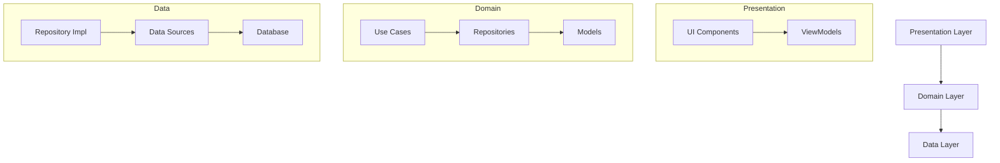
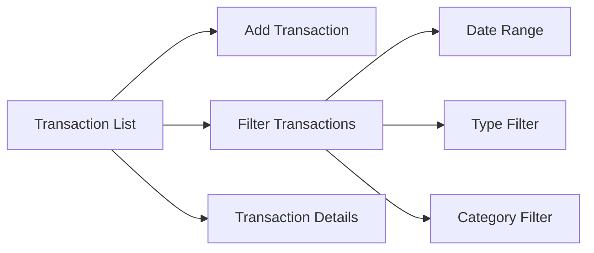
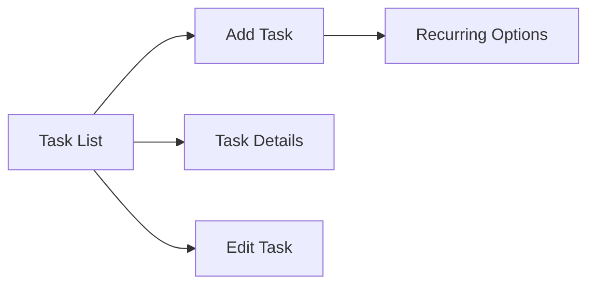
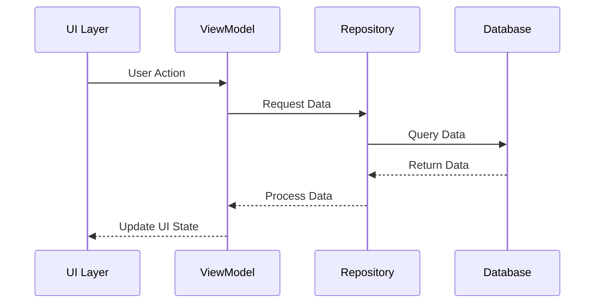

# WealthWise - Personal Finance Management App

WealthWise is a modern Android application designed to help users manage their personal finances effectively. Built with Kotlin and Jetpack Compose, it provides an intuitive interface for tracking transactions, managing financial tasks, and gaining insights into spending patterns.

## 🌟 Features

### Transaction Management
- Track income and expenses
- Categorize transactions
- Filter transactions by date range, type, and category
- View financial summary (current balance, total income, total expenses)

### Task Management
- Create and manage financial tasks
- Set recurring tasks
- Track task completion status
- Set due dates and reminders

### Insights (Coming Soon)
- Spending patterns analysis
- Budget tracking
- Financial goals progress
- Custom reports and visualizations

## 🏗 Architecture

WealthWise follows Clean Architecture principles and MVVM pattern, ensuring separation of concerns and maintainable code.



### Layer Structure

1. **Presentation Layer**
   - UI Components (Compose)
   - ViewModels
   - State Management
   - Navigation

2. **Domain Layer**
   - Business Logic
   - Use Cases
   - Repository Interfaces
   - Domain Models

3. **Data Layer**
   - Repository Implementations
   - Data Sources
   - Database (Room)
   - Data Models

## 🛠 Technical Stack

- **Language**: Kotlin
- **UI Framework**: Jetpack Compose
- **Architecture**: MVVM + Clean Architecture
- **Dependency Injection**: Hilt
- **Database**: Room
- **Coroutines**: For asynchronous operations
- **Flow**: For reactive programming
- **Material Design 3**: For modern UI components

## 📱 Screenshots

### Transaction Management


### Task Management
<div style="display: flex; gap: 20px;">
    
    
</div>



## 🚀 Getting Started

### Prerequisites
- Android Studio Arctic Fox or newer
- JDK 11 or newer
- Android SDK 31 or newer

### Installation
1. Clone the repository:
   ```bash
   git clone https://github.com/yourusername/wealthwise.git
   ```

2. Open the project in Android Studio

3. Build and run the application

## 📦 Project Structure

```
app/
├── data/
│   ├── database/
│   │   ├── dao/
│   │   ├── model/
│   │   └── TypeConverters.kt
│   └── repository/
├── domain/
│   ├── model/
│   └── repository/
└── presentation/
    ├── features/
    │   ├── transactions/
    │   └── tasks/
    └── navigation/
```

## 🔄 Data Flow



## 🧪 Testing

The application includes:
- Unit Tests for ViewModels
- Integration Tests for Repositories
- UI Tests for Compose Components

## 📝 License

This project is licensed under the MIT License - see the [LICENSE](LICENSE) file for details.

## 🤝 Contributing

1. Fork the repository
2. Create your feature branch (`git checkout -b feature/AmazingFeature`)
3. Commit your changes (`git commit -m 'Add some AmazingFeature'`)
4. Push to the branch (`git push origin feature/AmazingFeature`)
5. Open a Pull Request

## 📫 Contact

Your Name - [@yourtwitter](https://twitter.com/yourtwitter)
Project Link: [https://github.com/yourusername/wealthwise](https://github.com/yourusername/wealthwise)

## 🙏 Acknowledgments

- Material Design 3 for the UI components
- Android Jetpack for the architecture components
- Room for the database implementation
- Hilt for dependency injection 